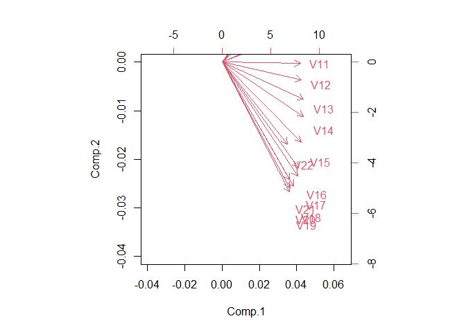
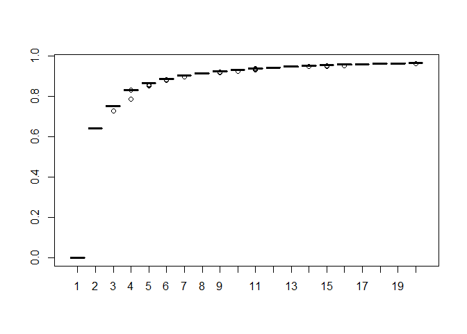
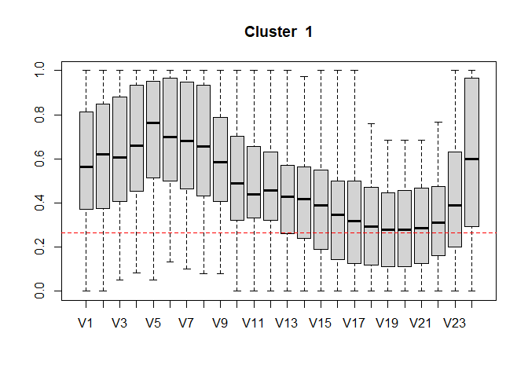
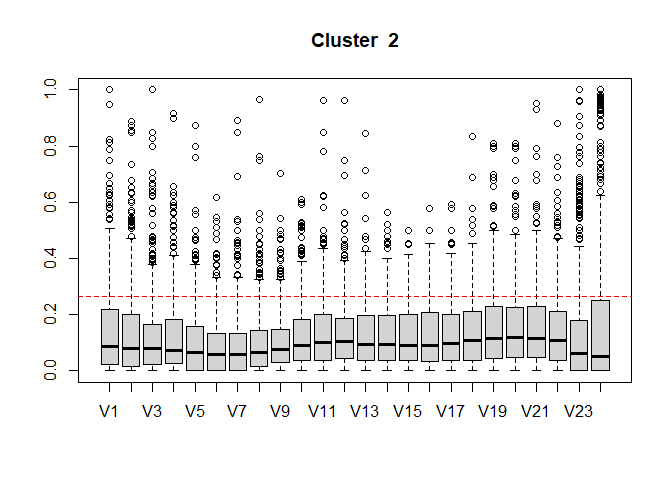

Edgar KOUAJIEP
2022-11-22

# 3.1 Load the data

``` r
rm(list = ls()) # clear the global environment 
load("velib.Rdata")
```

# 3.2 Pretreatment and descriptive analysis 
Let’s observe the 10th first rows of the section $data$

``` r
head(velib$data,10)
```

    ##               V1         V2        V3         V4        V5         V6
    ## 19117 0.07692308 0.26923077 0.3846154 0.23076923 0.1538462 0.15384615
    ## 17111 0.04347826 0.00000000 0.1304348 0.08695652 0.1739130 0.08695652
    ## 6103  0.10909091 0.12727273 0.1272727 0.18181818 0.1454545 0.10909091
    ## 15042 0.57142857 0.52380952 0.6666667 0.71428571 0.8095238 1.00000000
    ## 12003 1.00000000 0.94202899 1.0000000 0.98550725 1.0000000 1.00000000
    ## 13038 0.41666667 0.08333333 0.2083333 0.25000000 0.1250000 0.20833333
    ## 17041 0.58974359 0.46153846 0.3333333 0.33333333 0.3333333 0.17948718
    ## 41203 0.27450980 0.21568627 0.2352941 0.23529412 0.2156863 0.23529412
    ## 43401 0.97777778 1.00000000 1.0000000 0.95555556 0.9777778 0.86666667
    ## 5015  0.84126984 0.79365079 0.8095238 0.74603175 0.7777778 0.74603175
    ##               V7         V8         V9       V10       V11       V12        V13
    ## 19117 0.26923077 0.08000000 0.11538462 0.1153846 0.1153846 0.2307692 0.03846154
    ## 17111 0.04347826 0.04347826 0.21739130 0.3043478 0.3043478 0.4347826 0.52173913
    ## 6103  0.25454545 0.25454545 0.25454545 0.3272727 0.2407407 0.2181818 0.21818182
    ## 15042 1.00000000 0.95238095 0.95238095 0.9523810 0.9523810 0.9523810 0.95238095
    ## 12003 1.00000000 1.00000000 0.97101449 0.9565217 0.9130435 0.9130435 0.85507246
    ## 13038 0.12500000 0.12500000 0.12500000 0.2916667 0.2083333 0.1666667 0.08333333
    ## 17041 0.07692308 0.12820513 0.12820513 0.2564103 0.2307692 0.2564103 0.30769231
    ## 41203 0.19607843 0.19607843 0.09803922 0.1960784 0.2941176 0.2549020 0.27450980
    ## 43401 0.84444444 0.82222222 0.93333333 0.9777778 0.9111111 0.9111111 0.91111111
    ## 5015  0.92063492 1.00000000 1.00000000 0.9841270 1.0000000 1.0000000 0.95238095
    ##              V14        V15        V16        V17        V18        V19
    ## 19117 0.03846154 0.03846154 0.07692308 0.03846154 0.03846154 0.03846154
    ## 17111 0.47826087 0.47826087 0.47826087 0.43478261 0.43478261 0.43478261
    ## 6103  0.21818182 0.14545455 0.12727273 0.10909091 0.10909091 0.10909091
    ## 15042 0.95238095 0.95238095 0.95238095 0.95238095 0.95238095 0.95238095
    ## 12003 0.92753623 0.81159420 0.73913043 0.72463768 0.72463768 0.72463768
    ## 13038 0.16666667 0.16666667 0.16666667 0.16666667 0.16666667 0.16666667
    ## 17041 0.38461538 0.38461538 0.35897436 0.35897436 0.35897436 0.35897436
    ## 41203 0.27450980 0.29411765 0.33333333 0.33333333 0.33333333 0.33333333
    ## 43401 0.91111111 0.93333333 0.93333333 0.93333333 0.93333333 0.93333333
    ## 5015  0.90476190 0.98412698 0.98412698 0.98412698 0.98412698 0.96825397
    ##              V20        V21        V22        V23        V24        V25
    ## 19117 0.03846154 0.03846154 0.10714286 0.00000000 0.00000000 0.00000000
    ## 17111 0.43478261 0.43478261 0.26086957 0.04347826 0.13043478 0.08695652
    ## 6103  0.09090909 0.09090909 0.05454545 0.10909091 0.25454545 0.36363636
    ## 15042 0.95238095 1.00000000 1.00000000 1.00000000 1.00000000 0.95238095
    ## 12003 0.72463768 0.72463768 0.75362319 0.97101449 1.00000000 1.00000000
    ## 13038 0.16666667 0.16666667 0.08333333 0.00000000 0.04166667 0.00000000
    ## 17041 0.35897436 0.35897436 0.30769231 0.07692308 0.10256410 0.12820513
    ## 41203 0.33333333 0.33333333 0.19607843 0.01960784 0.00000000 0.00000000
    ## 43401 0.93333333 0.93333333 0.93333333 0.88888889 0.93333333 0.93333333
    ## 5015  0.98412698 0.96825397 0.96825397 0.95238095 0.98412698 1.00000000
    ##              V26        V27        V28        V29        V30        V31
    ## 19117 0.00000000 0.00000000 0.00000000 0.00000000 0.03571429 0.10714286
    ## 17111 0.08695652 0.04347826 0.08695652 0.04347826 0.00000000 0.04347826
    ## 6103  0.38181818 0.17021277 0.36956522 0.47826087 0.45652174 0.50000000
    ## 15042 1.00000000 1.00000000 1.00000000 1.00000000 1.00000000 0.95238095
    ## 12003 0.93333333 0.84444444 0.90000000 0.92452830 0.92452830 0.79245283
    ## 13038 0.00000000 0.16666667 0.20833333 0.25000000 0.00000000 0.04166667
    ## 17041 0.07692308 0.23076923 0.23076923 0.28205128 0.41025641 0.51282051
    ## 41203 0.00000000 0.03921569 0.00000000 0.01960784 0.03921569 0.03921569
    ## 43401 0.91111111 0.91111111 0.91111111 0.91111111 0.97777778 0.97777778
    ## 5015  0.95238095 1.00000000 0.92063492 1.00000000 1.00000000 0.96825397
    ##              V32       V33       V34       V35       V36        V37        V38
    ## 19117 0.10714286 0.2500000 0.3928571 0.4285714 0.5000000 0.39285714 0.39285714
    ## 17111 0.04347826 0.1304348 0.7826087 0.9130435 1.0000000 0.91304348 1.00000000
    ## 6103  0.52173913 0.4782609 0.4130435 0.3478261 0.3913043 0.28260870 0.28260870
    ## 15042 0.14285714 0.0952381 0.1904762 0.0952381 0.0952381 0.04761905 0.04761905
    ## 12003 0.58490566 0.4230769 0.3137255 0.4230769 0.4423077 0.34615385 0.40384615
    ## 13038 0.04166667 0.2500000 0.4583333 0.6250000 0.7916667 0.58333333 0.58333333
    ## 17041 0.46153846 0.5641026 0.4102564 0.6410256 0.6923077 0.66666667 0.64102564
    ## 41203 0.00000000 0.2745098 0.4509804 0.4901961 0.5882353 0.60784314 0.64705882
    ## 43401 0.95555556 1.0000000 1.0000000 1.0000000 0.9777778 0.95555556 0.95555556
    ## 5015  0.98412698 0.9523810 0.9047619 1.0000000 0.9523810 0.96825397 1.00000000
    ##              V39        V40        V41        V42        V43        V44
    ## 19117 0.53571429 0.57142857 0.57142857 0.57142857 0.57142857 0.57142857
    ## 17111 1.00000000 1.00000000 1.00000000 1.00000000 1.00000000 1.00000000
    ## 6103  0.28260870 0.34782609 0.34782609 0.34782609 0.34782609 0.34782609
    ## 15042 0.04761905 0.04761905 0.04761905 0.04761905 0.04761905 0.04761905
    ## 12003 0.35849057 0.43396226 0.39622642 0.32075472 0.32075472 0.32075472
    ## 13038 0.75000000 0.70833333 0.70833333 0.70833333 0.70833333 0.75000000
    ## 17041 0.58974359 0.61538462 0.61538462 0.66666667 0.66666667 0.64102564
    ## 41203 0.68627451 0.68627451 0.70588235 0.74509804 0.76470588 0.76470588
    ## 43401 0.62222222 0.62222222 0.66666667 0.66666667 0.66666667 0.66666667
    ## 5015  0.98412698 0.98412698 1.00000000 1.00000000 1.00000000 0.98412698
    ##              V45       V46       V47        V48        V49        V50
    ## 19117 0.57142857 0.5357143 0.1111111 0.00000000 0.00000000 0.03703704
    ## 17111 1.00000000 1.0000000 0.0000000 0.04347826 0.00000000 0.00000000
    ## 6103  0.34782609 0.2608696 0.5272727 0.65454545 0.72727273 0.87272727
    ## 15042 0.04761905 0.2857143 1.0000000 1.00000000 0.95238095 1.00000000
    ## 12003 0.32075472 0.3392857 0.5797101 0.84057971 0.81159420 0.73913043
    ## 13038 0.66666667 0.5833333 0.3333333 0.12500000 0.12500000 0.04166667
    ## 17041 0.64102564 0.5641026 0.2307692 0.10256410 0.15384615 0.15384615
    ## 41203 0.74509804 0.6862745 0.3921569 0.13725490 0.05882353 0.01960784
    ## 43401 0.64444444 0.6444444 0.5333333 0.40000000 0.40000000 0.40000000
    ## 5015  0.96825397 0.9206349 0.7460317 0.90476190 0.96825397 0.96825397
    ##              V51        V52        V53        V54        V55       V56
    ## 19117 0.11111111 0.11111111 0.03703704 0.00000000 0.03703704 0.1851852
    ## 17111 0.08695652 0.00000000 0.04347826 0.08695652 0.08695652 0.0000000
    ## 6103  0.81818182 1.00000000 0.92727273 0.90909091 0.83636364 0.7272727
    ## 15042 0.57142857 0.61904762 0.85714286 0.76190476 0.76190476 0.1428571
    ## 12003 0.62318841 0.75362319 0.91304348 0.92647059 0.94202899 0.8985507
    ## 13038 0.12500000 0.04166667 0.04166667 0.08333333 0.33333333 0.3333333
    ## 17041 0.15384615 0.17948718 0.15384615 0.15384615 0.23076923 0.2307692
    ## 41203 0.03921569 0.00000000 0.01960784 0.01960784 0.00000000 0.1372549
    ## 43401 0.44444444 0.40000000 0.42222222 0.51111111 0.42222222 0.3555556
    ## 5015  0.92063492 0.96825397 0.93650794 0.96825397 0.95161290 0.7741935
    ##             V57       V58       V59       V60       V61       V62       V63
    ## 19117 0.1481481 0.1481481 0.2222222 0.6296296 0.4444444 0.2962963 0.2222222
    ## 17111 0.6521739 1.0000000 0.9565217 1.0000000 0.9565217 1.0000000 1.0000000
    ## 6103  0.6545455 0.6545455 0.8909091 0.9818182 0.9454545 0.8909091 0.4181818
    ## 15042 0.0952381 0.0952381 0.0952381 0.0952381 0.0952381 0.1428571 0.1428571
    ## 12003 0.7536232 0.7205882 0.6521739 0.6086957 0.6231884 0.5942029 0.5072464
    ## 13038 0.7083333 0.5000000 0.7916667 0.6250000 0.5416667 0.5000000 0.4583333
    ## 17041 0.3589744 0.2820513 0.4102564 0.3846154 0.5384615 0.5384615 0.5384615
    ## 41203 0.2549020 0.4705882 0.5490196 0.6470588 0.7058824 0.7450980 0.7254902
    ## 43401 0.4666667 0.6000000 0.5777778 0.5777778 0.5777778 0.6000000 0.6000000
    ## 5015  0.6451613 0.3387097 0.3870968 0.5000000 0.5645161 0.5806452 0.6451613
    ##             V64       V65       V66       V67       V68       V69       V70
    ## 19117 0.4814815 0.5555556 0.5925926 0.5925926 0.5925926 0.5555556 0.5185185
    ## 17111 0.8260870 0.8260870 0.8260870 0.8260870 0.8260870 0.8260870 0.6956522
    ## 6103  0.4000000 0.4000000 0.4000000 0.2363636 0.2363636 0.2181818 0.1090909
    ## 15042 0.0952381 0.1904762 0.1904762 0.1904762 0.1904762 0.1904762 0.4761905
    ## 12003 0.4347826 0.3913043 0.3623188 0.3478261 0.2753623 0.2753623 0.2608696
    ## 13038 0.5416667 0.6666667 0.6666667 0.7083333 0.7083333 0.6666667 0.5000000
    ## 17041 0.5384615 0.5384615 0.4102564 0.4102564 0.4102564 0.3846154 0.2564103
    ## 41203 0.7450980 0.7450980 0.7450980 0.7450980 0.7254902 0.7254902 0.4705882
    ## 43401 0.6000000 0.6000000 0.6000000 0.6000000 0.6000000 0.6000000 0.6000000
    ## 5015  0.6774194 0.6774194 0.6935484 0.6935484 0.7096774 0.7096774 0.6290323
    ##              V71        V72        V73        V74       V75        V76
    ## 19117 0.18518519 0.00000000 0.00000000 0.00000000 0.0000000 0.00000000
    ## 17111 0.00000000 0.04347826 0.00000000 0.04347826 0.0000000 0.00000000
    ## 6103  0.12727273 0.23636364 0.32727273 0.49090909 0.4727273 0.52727273
    ## 15042 1.00000000 1.00000000 1.00000000 0.88888889 0.1111111 0.16666667
    ## 12003 0.54411765 0.79411765 0.82352941 0.80597015 0.6764706 0.64705882
    ## 13038 0.04166667 0.08333333 0.08333333 0.00000000 0.1250000 0.16666667
    ## 17041 0.12820513 0.07692308 0.05263158 0.05263158 0.1578947 0.23684211
    ## 41203 0.09803922 0.00000000 0.00000000 0.00000000 0.0000000 0.03921569
    ## 43401 0.48888889 0.37777778 0.37777778 0.35555556 0.3777778 0.40000000
    ## 5015  0.37096774 0.46774194 0.43548387 0.45161290 0.4193548 0.33870968
    ##              V77        V78        V79        V80        V81        V82
    ## 19117 0.03571429 0.14285714 0.00000000 0.10714286 0.50000000 1.00000000
    ## 17111 0.04347826 0.08695652 0.08695652 0.21739130 0.60869565 0.86956522
    ## 6103  0.49090909 0.45454545 0.45454545 0.47272727 0.32727273 0.38181818
    ## 15042 0.27777778 0.50000000 0.50000000 0.05555556 0.00000000 0.11111111
    ## 12003 0.69117647 0.80597015 0.81538462 0.68181818 0.56060606 0.54545455
    ## 13038 0.25000000 0.33333333 0.41666667 0.16666667 0.37500000 0.37500000
    ## 17041 0.31578947 0.31578947 0.28947368 0.18421053 0.34210526 0.47368421
    ## 41203 0.03921569 0.07843137 0.03921569 0.13725490 0.29411765 0.43137255
    ## 43401 0.44444444 0.46666667 0.46666667 0.51111111 0.45454545 0.50000000
    ## 5015  0.30645161 0.40322581 0.38709677 0.22580645 0.06451613 0.03225806
    ##              V83        V84       V85       V86       V87        V88        V89
    ## 19117 0.96428571 0.96428571 0.7777778 0.3333333 0.2857143 0.46428571 0.57142857
    ## 17111 0.78260870 0.86956522 0.9565217 1.0000000 0.9130435 0.95652174 0.95652174
    ## 6103  0.43636364 0.43636364 0.4000000 0.3818182 0.4181818 0.40000000 0.41818182
    ## 15042 0.00000000 0.00000000 0.0000000 0.0000000 0.0000000 0.00000000 0.00000000
    ## 12003 0.54545455 0.49253731 0.3382353 0.2500000 0.1470588 0.05882353 0.05882353
    ## 13038 0.16666667 0.25000000 0.5000000 0.4583333 0.6250000 0.58333333 0.58333333
    ## 17041 0.42105263 0.44736842 0.4736842 0.4210526 0.5263158 0.50000000 0.47368421
    ## 41203 0.52941176 0.56862745 0.6666667 0.7254902 0.7843137 0.78431373 0.78431373
    ## 43401 0.40909091 0.38636364 0.4545455 0.4545455 0.4545455 0.45454545 0.45454545
    ## 5015  0.01612903 0.09677419 0.2096774 0.2419355 0.3225806 0.29032258 0.32258065
    ##              V90        V91        V92        V93       V94        V95
    ## 19117 0.50000000 0.50000000 0.50000000 0.46428571 0.5000000 0.03571429
    ## 17111 1.00000000 1.00000000 1.00000000 1.00000000 0.7826087 0.00000000
    ## 6103  0.41818182 0.43636364 0.43636364 0.41818182 0.3272727 0.34545455
    ## 15042 0.00000000 0.00000000 0.00000000 0.11111111 0.5294118 0.95238095
    ## 12003 0.07352941 0.05882353 0.05882353 0.05882353 0.1029412 0.39705882
    ## 13038 0.62500000 0.62500000 0.62500000 0.50000000 0.3333333 0.04166667
    ## 17041 0.50000000 0.50000000 0.47368421 0.44736842 0.3157895 0.07894737
    ## 41203 0.80392157 0.80392157 0.78431373 0.78431373 0.5882353 0.29411765
    ## 43401 0.45454545 0.47727273 0.47727273 0.50000000 0.5000000 0.43181818
    ## 5015  0.32258065 0.32258065 0.33870968 0.33870968 0.2741935 0.11290323
    ##              V96        V97        V98        V99       V100       V101
    ## 19117 0.07142857 0.07142857 0.07142857 0.10714286 0.21428571 0.21428571
    ## 17111 0.00000000 0.00000000 0.04347826 0.00000000 0.00000000 0.08695652
    ## 6103  0.45454545 0.45454545 0.40000000 0.41818182 0.50909091 0.43636364
    ## 15042 1.00000000 1.00000000 0.85714286 0.57142857 0.61904762 0.76190476
    ## 12003 0.74626866 0.68656716 0.68656716 0.61194030 0.73134328 0.73134328
    ## 13038 0.00000000 0.08333333 0.16666667 0.25000000 0.33333333 0.37500000
    ## 17041 0.12820513 0.12820513 0.07692308 0.07692308 0.07692308 0.15384615
    ## 41203 0.17647059 0.11764706 0.07843137 0.11764706 0.07843137 0.03921569
    ## 43401 0.43181818 0.43181818 0.38636364 0.43181818 0.43181818 0.43181818
    ## 5015  0.30158730 0.38095238 0.41269841 0.39682540 0.31746032 0.20634921
    ##             V102       V103       V104       V105       V106       V107
    ## 19117 0.03571429 0.03571429 0.10714286 0.32142857 0.75000000 1.00000000
    ## 17111 0.13043478 0.17391304 0.34782609 0.47826087 1.00000000 1.00000000
    ## 6103  0.58181818 0.61818182 0.61818182 0.61818182 0.43636364 0.45454545
    ## 15042 0.71428571 0.52380952 0.09523810 0.00000000 0.04761905 0.04761905
    ## 12003 0.71641791 0.70149254 0.68656716 0.68656716 0.53030303 0.68181818
    ## 13038 0.29166667 0.33333333 0.12500000 0.37500000 0.20833333 0.37500000
    ## 17041 0.10256410 0.05128205 0.05128205 0.20512821 0.51282051 0.53846154
    ## 41203 0.01960784 0.03921569 0.17647059 0.31372549 0.33333333 0.39215686
    ## 43401 0.47727273 0.50000000 0.52272727 0.52272727 0.52272727 0.50000000
    ## 5015  0.25396825 0.28571429 0.00000000 0.03174603 0.03174603 0.11111111
    ##             V108       V109       V110      V111       V112       V113
    ## 19117 0.81481481 0.70370370 0.44444444 0.5555556 0.59259259 0.51851852
    ## 17111 1.00000000 0.86956522 1.00000000 1.0000000 0.82608696 0.82608696
    ## 6103  0.43636364 0.52727273 0.45454545 0.4181818 0.40000000 0.41818182
    ## 15042 0.04761905 0.04761905 0.00000000 0.0952381 0.04761905 0.04761905
    ## 12003 0.65671642 0.68656716 0.61194030 0.4925373 0.43283582 0.38805970
    ## 13038 0.29166667 0.16666667 0.08695652 0.1666667 0.16666667 0.20833333
    ## 17041 0.57894737 0.61538462 0.69230769 0.7179487 0.74358974 0.74358974
    ## 41203 0.43137255 0.47058824 0.56862745 0.6862745 0.68627451 0.68627451
    ## 43401 0.50000000 0.50000000 0.52272727 0.5227273 0.52272727 0.52272727
    ## 5015  0.15873016 0.19047619 0.14285714 0.1904762 0.20634921 0.22222222
    ##             V114       V115       V116       V117       V118       V119
    ## 19117 0.62962963 0.59259259 0.66666667 0.59259259 0.70370370 0.03571429
    ## 17111 0.82608696 0.82608696 0.82608696 0.73913043 0.39130435 0.00000000
    ## 6103  0.40000000 0.40000000 0.40000000 0.40000000 0.25454545 0.29629630
    ## 15042 0.04761905 0.04761905 0.04761905 0.09523810 0.38095238 1.00000000
    ## 12003 0.26865672 0.28358209 0.25757576 0.28358209 0.22727273 0.49253731
    ## 13038 0.16666667 0.20833333 0.20833333 0.08333333 0.08333333 0.00000000
    ## 17041 0.74358974 0.76923077 0.74358974 0.74358974 0.51282051 0.25641026
    ## 41203 0.68627451 0.68627451 0.66666667 0.62745098 0.37254902 0.11764706
    ## 43401 0.56818182 0.59090909 0.59090909 0.59090909 0.56818182 0.52272727
    ## 5015  0.20634921 0.20634921 0.22222222 0.25396825 0.14285714 0.07936508
    ##             V120       V121       V122       V123       V124       V125
    ## 19117 0.03571429 0.03571429 0.03571429 0.14285714 0.17857143 0.07142857
    ## 17111 0.00000000 0.00000000 0.04347826 0.08695652 0.08695652 0.00000000
    ## 6103  0.38888889 0.43636364 0.41818182 0.40000000 0.61818182 0.63636364
    ## 15042 0.61904762 0.76190476 0.71428571 0.42857143 0.95238095 0.90476190
    ## 12003 0.86363636 0.86363636 0.83333333 0.83076923 0.89393939 0.96969697
    ## 13038 0.04166667 0.08333333 0.04166667 0.00000000 0.08333333 0.04166667
    ## 17041 0.15384615 0.25641026 0.25641026 0.28205128 0.10256410 0.10256410
    ## 41203 0.01960784 0.03921569 0.00000000 0.03921569 0.01960784 0.00000000
    ## 43401 0.47727273 0.45454545 0.45454545 0.47727273 0.45454545 0.43181818
    ## 5015  0.09523810 0.12698413 0.12698413 0.31746032 0.33333333 0.33333333
    ##            V126       V127       V128       V129      V130       V131      V132
    ## 19117 0.0000000 0.03571429 0.10714286 0.42857143 0.8928571 0.82142857 0.9285714
    ## 17111 0.1739130 0.13043478 0.34782609 0.78260870 0.9565217 1.00000000 0.8695652
    ## 6103  0.8181818 0.92727273 0.96363636 0.98181818 0.9636364 0.85454545 0.7272727
    ## 15042 0.7619048 0.23809524 0.04761905 0.00000000 0.0000000 0.04761905 0.0952381
    ## 12003 0.9696970 0.80000000 0.71212121 0.60000000 0.3939394 0.50000000 0.6307692
    ## 13038 0.2916667 0.41666667 0.33333333 0.66666667 0.6666667 0.70833333 0.5833333
    ## 17041 0.2564103 0.30769231 0.28205128 0.53846154 0.5641026 0.66666667 0.7435897
    ## 41203 0.0000000 0.00000000 0.09803922 0.09803922 0.2745098 0.21568627 0.3725490
    ## 43401 0.4545455 0.45454545 0.52272727 0.52272727 0.4772727 0.54545455 0.5454545
    ## 5015  0.3174603 0.25396825 0.15873016 0.00000000 0.0000000 0.04761905 0.1111111
    ##            V133      V134      V135      V136      V137      V138      V139
    ## 19117 1.0000000 0.6428571 0.5357143 0.2500000 0.3214286 0.2857143 0.3571429
    ## 17111 0.9565217 1.0000000 1.0000000 1.0000000 1.0000000 1.0000000 1.0000000
    ## 6103  0.7454545 0.4727273 0.5636364 0.4909091 0.4727273 0.4545455 0.4545455
    ## 15042 0.0952381 0.1428571 0.0952381 0.0952381 0.1428571 0.1428571 0.1428571
    ## 12003 0.7538462 0.7692308 0.8461538 0.7384615 0.6562500 0.6153846 0.5000000
    ## 13038 0.8750000 0.8750000 0.9166667 0.8750000 0.8750000 0.9583333 0.9583333
    ## 17041 0.8157895 0.7894737 0.8421053 0.9210526 0.9210526 0.9210526 0.9487179
    ## 41203 0.3921569 0.4509804 0.6078431 0.6862745 0.7450980 0.7647059 0.8235294
    ## 43401 0.5454545 0.5681818 0.5909091 0.6363636 0.6590909 0.7045455 0.7272727
    ## 5015  0.2063492 0.1587302 0.2539683 0.1904762 0.3174603 0.3809524 0.4285714
    ##            V140      V141      V142      V143      V144       V145       V146
    ## 19117 0.3571429 0.3571429 0.3214286 0.3214286 0.3571429 0.32142857 0.21428571
    ## 17111 1.0000000 1.0000000 0.9565217 0.8260870 0.8260870 0.65217391 0.56521739
    ## 6103  0.4545455 0.4363636 0.4181818 0.4363636 0.4363636 0.52727273 0.58181818
    ## 15042 0.1428571 0.1428571 0.1428571 0.1428571 0.1904762 0.38095238 0.52380952
    ## 12003 0.3939394 0.3484848 0.3030303 0.3484848 0.3030303 0.34848485 0.36363636
    ## 13038 0.9166667 0.7916667 0.6666667 0.7083333 0.7916667 0.70833333 0.75000000
    ## 17041 0.9487179 0.9487179 0.9230769 0.8717949 0.8205128 0.76923077 0.79487179
    ## 41203 0.8235294 0.7843137 0.7450980 0.6862745 0.6274510 0.62745098 0.56862745
    ## 43401 0.7272727 0.7045455 0.7045455 0.7272727 0.7272727 0.72727273 0.77272727
    ## 5015  0.3650794 0.3809524 0.3174603 0.2539683 0.1746032 0.07936508 0.03174603
    ##            V147       V148       V149       V150       V151       V152
    ## 19117 0.2500000 0.03571429 0.00000000 0.03571429 0.07142857 0.28571429
    ## 17111 0.3043478 0.13043478 0.04347826 0.00000000 0.21739130 0.00000000
    ## 6103  0.5636364 0.50909091 0.56363636 0.61818182 0.67272727 0.61818182
    ## 15042 0.4761905 0.42857143 0.38095238 0.52380952 0.61904762 0.52380952
    ## 12003 0.2615385 0.21212121 0.25757576 0.28787879 0.26562500 0.09375000
    ## 13038 0.6666667 0.95833333 0.87500000 0.41666667 0.21739130 0.17391304
    ## 17041 0.6410256 0.61538462 0.51282051 0.46153846 0.41025641 0.23076923
    ## 41203 0.5686275 0.50980392 0.45098039 0.45098039 0.39215686 0.29411765
    ## 43401 0.6888889 0.68888889 0.68888889 0.64444444 0.62222222 0.60000000
    ## 5015  0.1111111 0.06349206 0.07936508 0.04761905 0.11111111 0.07936508
    ##             V153       V154       V155       V156       V157       V158
    ## 19117 0.03571429 0.37037037 0.00000000 0.03703704 0.11111111 0.07407407
    ## 17111 0.26086957 0.26086957 0.34782609 0.52173913 0.60869565 0.39130435
    ## 6103  0.60000000 0.53703704 0.62962963 0.66666667 0.59259259 0.62962963
    ## 15042 0.57142857 0.42857143 0.42857143 0.33333333 0.33333333 0.33333333
    ## 12003 0.06250000 0.14285714 0.12500000 0.07812500 0.24242424 0.34848485
    ## 13038 0.43478261 0.30434783 0.04347826 0.04347826 0.08695652 0.13043478
    ## 17041 0.17948718 0.17948718 0.20512821 0.30769231 0.23076923 0.41025641
    ## 41203 0.39215686 0.21568627 0.21568627 0.13725490 0.15686275 0.35294118
    ## 43401 0.53333333 0.62222222 0.62222222 0.62222222 0.66666667 0.66666667
    ## 5015  0.20634921 0.03174603 0.04761905 0.20634921 0.12698413 0.12698413
    ##            V159      V160      V161       V162       V163      V164       V165
    ## 19117 0.1481481 0.1111111 0.1111111 0.14814815 0.14814815 0.1481481 0.11111111
    ## 17111 0.3913043 0.5652174 0.6956522 0.69565217 0.69565217 0.6956522 0.69565217
    ## 6103  0.6481481 0.5740741 0.5555556 0.50000000 0.50000000 0.5000000 0.55555556
    ## 15042 0.3333333 0.3809524 0.3809524 0.38095238 0.38095238 0.3809524 0.38095238
    ## 12003 0.3939394 0.3939394 0.3181818 0.27272727 0.19696970 0.1666667 0.16666667
    ## 13038 0.1739130 0.1739130 0.1739130 0.04347826 0.08695652 0.1304348 0.04347826
    ## 17041 0.4102564 0.4358974 0.4102564 0.41025641 0.43589744 0.4358974 0.43589744
    ## 41203 0.3921569 0.5098039 0.5490196 0.66666667 0.68627451 0.6470588 0.64705882
    ## 43401 0.6666667 0.6666667 0.6888889 0.64444444 0.66666667 0.6666667 0.68888889
    ## 5015  0.4285714 0.3174603 0.3015873 0.31746032 0.33333333 0.3492063 0.34920635
    ##             V166       V167      V168      V169       V170       V171
    ## 19117 0.11111111 0.18518519 0.1111111 0.1111111 0.07407407 0.07407407
    ## 17111 0.78260870 0.73913043 0.7391304 0.5652174 0.26086957 0.17391304
    ## 6103  0.55555556 0.51851852 0.5370370 0.4259259 0.40740741 0.33333333
    ## 15042 0.38095238 0.38095238 0.5238095 0.9047619 1.00000000 1.00000000
    ## 12003 0.12121212 0.10606061 0.1363636 0.1818182 0.21212121 0.31818182
    ## 13038 0.04347826 0.04347826 0.1739130 0.1739130 0.08695652 0.26086957
    ## 17041 0.38461538 0.33333333 0.2820513 0.3846154 0.30769231 0.33333333
    ## 41203 0.56862745 0.56862745 0.5294118 0.4901961 0.49019608 0.43137255
    ## 43401 0.64444444 0.62222222 0.6444444 0.7555556 0.77272727 0.75555556
    ## 5015  0.34920635 0.33333333 0.3809524 0.2857143 0.31746032 0.14285714
    ##             V172       V173      V174       V175       V176       V177
    ## 19117 0.29629630 0.11111111 0.1111111 0.14814815 0.30769231 0.07692308
    ## 17111 0.04347826 0.00000000 0.2173913 0.13043478 0.04545455 0.17391304
    ## 6103  0.25925926 0.25925926 0.2037037 0.12962963 0.14814815 0.29629630
    ## 15042 1.00000000 1.00000000 0.9047619 0.85714286 0.85714286 0.85714286
    ## 12003 0.22727273 0.45454545 0.5909091 0.83333333 1.00000000 0.81818182
    ## 13038 0.34782609 0.08695652 0.1153846 0.08695652 0.13043478 0.08695652
    ## 17041 0.07692308 0.07692308 0.1282051 0.15384615 0.17948718 0.20512821
    ## 41203 0.41176471 0.39215686 0.2941176 0.29411765 0.33333333 0.31372549
    ## 43401 0.73333333 0.77777778 0.8666667 0.84444444 0.62222222 0.59090909
    ## 5015  0.19047619 0.11111111 0.1269841 0.04761905 0.03174603 0.06349206
    ##             V178       V179      V180      V181
    ## 19117 0.11538462 0.07692308 0.1538462 0.1538462
    ## 17111 0.17391304 0.17391304 0.2608696 0.3913043
    ## 6103  0.31481481 0.37037037 0.3703704 0.4074074
    ## 15042 0.76190476 0.76190476 0.7619048 0.7619048
    ## 12003 0.63636364 0.71212121 0.6212121 0.5757576
    ## 13038 0.08695652 0.43478261 0.3913043 0.5217391
    ## 17041 0.23076923 0.30769231 0.3076923 0.3076923
    ## 41203 0.43137255 0.47058824 0.4705882 0.5490196
    ## 43401 0.63636364 0.75000000 0.7500000 0.7272727
    ## 5015  0.09523810 0.09523810 0.1428571 0.1428571

A row contains the values of the load at different recording times, each time being given by the variable Vi.

``` r
names <- colnames(velib$data) # get the columns of the data

result <- rep(0, length(names))
for (i in 1:length(names))
  colName = names[i]
  result[i] = sum(is.nan(velib$data$colName))# verify any missing values

result
```

    ##   [1] 0 0 0 0 0 0 0 0 0 0 0 0 0 0 0 0 0 0 0 0 0 0 0 0 0 0 0 0 0 0 0 0 0 0 0 0 0
    ##  [38] 0 0 0 0 0 0 0 0 0 0 0 0 0 0 0 0 0 0 0 0 0 0 0 0 0 0 0 0 0 0 0 0 0 0 0 0 0
    ##  [75] 0 0 0 0 0 0 0 0 0 0 0 0 0 0 0 0 0 0 0 0 0 0 0 0 0 0 0 0 0 0 0 0 0 0 0 0 0
    ## [112] 0 0 0 0 0 0 0 0 0 0 0 0 0 0 0 0 0 0 0 0 0 0 0 0 0 0 0 0 0 0 0 0 0 0 0 0 0
    ## [149] 0 0 0 0 0 0 0 0 0 0 0 0 0 0 0 0 0 0 0 0 0 0 0 0 0 0 0 0 0 0 0 0 0

There is no missing data on the section $data$. By doing the same for
the other sections, we get to the same result. So the dataset is clean.

Now let’s visualize the data with their overall median (which will call
for the study purpose the “grand median”)

``` r
medianall = median(apply(velib$data,2,median))
boxplot(velib$data)
abline(h=medianall,lty=2,col='red') # plot the overall median
```

<!-- -->

This figure shows the distribution for each variable based on its value at each station. More objectively, it gives the distribution of the load at a specific period of time in a day (that spans a 1 hour). Also, we can see that the median , the 1st and 3rd quartile follow a certain sine-like pattern, implying that we can focus on just a portion of the data. The useful window of data will probably spans a day-like period which corresponds 24 observations. To verify that, we need to zoom on the boxplot and look at the section $dates$ from the dataset

``` r
boxplot(velib$data[1:72])
abline(h=medianall,lty=2,col='red') # plot the overall median
```

<!-- -->

``` r
velib$dates
```

    ##   [1] "Dim-11" "Dim-12" "Dim-13" "Dim-14" "Dim-15" "Dim-16" "Dim-17" "Dim-18"
    ##   [9] "Dim-19" "Dim-20" "Dim-21" "Dim-22" "Dim-23" "Lun-00" "Lun-01" "Lun-02"
    ##  [17] "Lun-03" "Lun-04" "Lun-05" "Lun-06" "Lun-07" "Lun-08" "Lun-09" "Lun-10"
    ##  [25] "Lun-11" "Lun-12" "Lun-13" "Lun-14" "Lun-15" "Lun-16" "Lun-17" "Lun-18"
    ##  [33] "Lun-19" "Lun-20" "Lun-21" "Lun-22" "Lun-23" "Mar-00" "Mar-01" "Mar-02"
    ##  [41] "Mar-03" "Mar-04" "Mar-05" "Mar-06" "Mar-07" "Mar-08" "Mar-09" "Mar-10"
    ##  [49] "Mar-11" "Mar-12" "Mar-13" "Mar-14" "Mar-15" "Mar-16" "Mar-17" "Mar-18"
    ##  [57] "Mar-19" "Mar-20" "Mar-21" "Mar-22" "Mar-23" "Mer-00" "Mer-01" "Mer-02"
    ##  [65] "Mer-03" "Mer-04" "Mer-05" "Mer-06" "Mer-07" "Mer-08" "Mer-09" "Mer-10"
    ##  [73] "Mer-11" "Mer-12" "Mer-13" "Mer-14" "Mer-15" "Mer-16" "Mer-17" "Mer-18"
    ##  [81] "Mer-19" "Mer-20" "Mer-21" "Mer-22" "Mer-23" "Jeu-00" "Jeu-01" "Jeu-02"
    ##  [89] "Jeu-03" "Jeu-04" "Jeu-05" "Jeu-06" "Jeu-07" "Jeu-08" "Jeu-09" "Jeu-10"
    ##  [97] "Jeu-11" "Jeu-12" "Jeu-13" "Jeu-14" "Jeu-15" "Jeu-16" "Jeu-17" "Jeu-18"
    ## [105] "Jeu-19" "Jeu-20" "Jeu-21" "Jeu-22" "Jeu-23" "Ven-00" "Ven-01" "Ven-02"
    ## [113] "Ven-03" "Ven-04" "Ven-05" "Ven-06" "Ven-07" "Ven-08" "Ven-09" "Ven-10"
    ## [121] "Ven-11" "Ven-12" "Ven-13" "Ven-14" "Ven-15" "Ven-16" "Ven-17" "Ven-18"
    ## [129] "Ven-19" "Ven-20" "Ven-21" "Ven-22" "Ven-23" "Sam-00" "Sam-01" "Sam-02"
    ## [137] "Sam-03" "Sam-04" "Sam-05" "Sam-06" "Sam-07" "Sam-08" "Sam-09" "Sam-10"
    ## [145] "Sam-11" "Sam-12" "Sam-13" "Sam-14" "Sam-15" "Sam-16" "Sam-17" "Sam-18"
    ## [153] "Sam-19" "Sam-20" "Sam-21" "Sam-22" "Sam-23" "Dim-00" "Dim-01" "Dim-02"
    ## [161] "Dim-03" "Dim-04" "Dim-05" "Dim-06" "Dim-07" "Dim-08" "Dim-09" "Dim-10"
    ## [169] "Dim-11" "Dim-12" "Dim-13" "Dim-14" "Dim-15" "Dim-16" "Dim-17" "Dim-18"
    ## [177] "Dim-19" "Dim-20" "Dim-21" "Dim-22" "Dim-23"

As we predicted, we can cover a “daily” period by taking from “Dim-11” (or 11am on Sunday) to “Lun-10” (or 10 am on the next Monday) which spans from V1 to V24. So the 1st 24 observations will be our basis for the next step which is feature extraction.

``` r
velib_data <- velib$data[1:24]
```

# 3.3 Feature extraction 
At the beginning, we had 181 variables. 
Thanks to the descriptive analysis, we have 24 useful features now. In addition, the sine-like pattern we observed earlier gives us a clue on a possible strong correlation between the features. So we can use the famous PCA or Principal Component Analysis to perform dimension
reduction.

``` r
pc = princomp(velib_data) # estimate the matrix u
plot(pc)
```

<!-- -->

``` r
summary(pc)
```

    ## Importance of components:
    ##                           Comp.1    Comp.2     Comp.3     Comp.4     Comp.5
    ## Standard deviation     1.3561002 0.6263693 0.35630790 0.33235741 0.24341552
    ## Proportion of Variance 0.6820283 0.1455056 0.04708361 0.04096656 0.02197431
    ## Cumulative Proportion  0.6820283 0.8275338 0.87461744 0.91558401 0.93755832
    ##                            Comp.6      Comp.7      Comp.8      Comp.9
    ## Standard deviation     0.17969424 0.154171773 0.134190311 0.126991895
    ## Proportion of Variance 0.01197532 0.008815126 0.006678226 0.005980959
    ## Cumulative Proportion  0.94953364 0.958348766 0.965026993 0.971007952
    ##                           Comp.10     Comp.11     Comp.12     Comp.13
    ## Standard deviation     0.10592739 0.100322258 0.090081695 0.085396979
    ## Proportion of Variance 0.00416136 0.003732617 0.003009483 0.002704605
    ## Cumulative Proportion  0.97516931 0.978901929 0.981911412 0.984616017
    ##                            Comp.14     Comp.15     Comp.16     Comp.17
    ## Standard deviation     0.082196397 0.076878264 0.076090145 0.069871584
    ## Proportion of Variance 0.002505673 0.002191926 0.002147216 0.001810589
    ## Cumulative Proportion  0.987121689 0.989313616 0.991460831 0.993271421
    ##                           Comp.18     Comp.19     Comp.20     Comp.21
    ## Standard deviation     0.06453402 0.061434946 0.060377974 0.053116356
    ## Proportion of Variance 0.00154453 0.001399748 0.001351997 0.001046346
    ## Cumulative Proportion  0.99481595 0.996215698 0.997567696 0.998614042
    ##                             Comp.22      Comp.23      Comp.24
    ## Standard deviation     0.0425854629 0.0370220573 0.0235141726
    ## Proportion of Variance 0.0006725763 0.0005083232 0.0002050587
    ## Cumulative Proportion  0.9992866181 0.9997949413 1.0000000000

As we can see from the cumulative proportion, most of the information (ie 90% of them) are found in the 1st 4 PCA components (having the highest variances) . we can reduce our features ensemble to $d=4$ elements. However, note that the 3rd and 4th components don’t hold that much of the information due to their low proportion of variance. It could indicate that perhaps the 1st 2 components could be enough.

Let’s look at the Cattel Screee-test for confirmation

``` r
cattell <- function(pc,tau=0.1){
  
  p = length(pc$sdev)
  delta = abs(diff(pc$sdev)) # get the difference of standard deviation between each component
  treshold = tau * max(delta) # calculate the threshold ie the elbow of the curve
  
  for (d in 1:(p-2)){
    #identify the minimum dimension for which all posterio differences are smaller than the threshold
    if (prod(delta[(d+1):(p-1)] < treshold)) break 
  }
  
  plot(delta,type='b') # plot the posterio differences
  abline(h=treshold,lty=2,col='red') # plot the threshold
  abline(v=d,lty=3,col='green') #plot the optimal d
  return(d)
  
}

dstar = cattell(pc,tau = 0.1)
```

<!-- -->

The pattern of the delta variable between the 1st and 4th index is due to the 3rd and 4th components having approximately the same variance whereas there is a big gap between the variance of the 2nd and 3rd component. In conclusion, the 1st 2 components are sufficient.

Let’s get the value of the PCA components

``` r
pc$loadings[,1:2] 
```

    ##        Comp.1       Comp.2
    ## V1  0.2071737  0.149791554
    ## V2  0.2048913  0.183180650
    ## V3  0.2101070  0.207852438
    ## V4  0.2134797  0.231572934
    ## V5  0.2167096  0.255136928
    ## V6  0.2131626  0.251754260
    ## V7  0.2063594  0.244585289
    ## V8  0.2052565  0.218345718
    ## V9  0.2107425  0.152117381
    ## V10 0.2096248  0.075780709
    ## V11 0.2157572 -0.002143507
    ## V12 0.2189001 -0.040285095
    ## V13 0.2246290 -0.084932198
    ## V14 0.2245507 -0.124060961
    ## V15 0.2182691 -0.183458949
    ## V16 0.2106726 -0.242652446
    ## V17 0.2079566 -0.261674433
    ## V18 0.1979834 -0.284810514
    ## V19 0.1867602 -0.298445877
    ## V20 0.1860790 -0.288922679
    ## V21 0.1856756 -0.269869177
    ## V22 0.1807237 -0.187901800
    ## V23 0.1652586  0.052986350
    ## V24 0.1616798  0.180205731

Moreover, let’s plot the variables in the new PCA coordinates system

``` r
biplot(pc, col = c(0,2));box()
```

<!-- -->

``` r
biplot(pc, col = c(0,2),ylim = c(-0.04,0));box()
```

<!-- -->

``` r
biplot(pc, col = c(0,2),ylim = c(0,0.04));box()
```

<!-- -->

Due to its high variance, the 1st component is obviously the one that holds most of the information.Plus, the projections of the initial feature vectors on that component have almost the same magnitude, making it difficult for extracting key differences between initial variables. Nevertheless, their projections on the 2nd component axis allow us to pin down groups of feature vectors, precisely feature’s profiles : 
- the 1st group representing the low-load values profile : Their 2nd component is always negative and the group is made of variables Vi where i goes from 1 to 10,including 23 and 24 too.  
- the 2nd group representing the high-load values profile: Their 2nd component is always positive and the group is made of variables Vi where i goes from 11 to 22 .

The 2 groups can be identified on the box plot by looking at the
position of their medians with respect to the grand median

``` r
boxplot(velib_data)
abline(h=medianall,lty=2,col='red') # plot the overall median
```

<!-- -->

``` r
#Recall that we can map those vectors to the actual recording time
cat(velib$dates[1:10],velib$dates[23],velib$dates[24]) # low-load profile
```

    ## Dim-11 Dim-12 Dim-13 Dim-14 Dim-15 Dim-16 Dim-17 Dim-18 Dim-19 Dim-20 Lun-09 Lun-10

``` r
velib$dates[11:22] # high loading profile
```

    ##  [1] "Dim-21" "Dim-22" "Dim-23" "Lun-00" "Lun-01" "Lun-02" "Lun-03" "Lun-04"
    ##  [9] "Lun-05" "Lun-06" "Lun-07" "Lun-08"

As anticipated, the low-load feature vectors correspond to periods spanning from 9 am to 8 pm . Objectively, this is a period of high-frequent human activities. People during that period often use the velibs and therefore, those bikes are seldom left loaded during a long time.

On the opposite, the high-load feature vectors correspond to periods between 9 pm to 8 am during which there are low-frequent human activities. In fact, People during that period seldom use the velibs and therefore, the velibs can load during a long time without frequent interruptions.

# 3.4 Clustering 
We will now use the projected data as our input to our clustering algorithms.

``` r
velib_data_proj = pc$scores[,1:2] # get the projection of the data in the subspace
```

## 3.4.1 Hierarchical clustering

Let’s start using the Ward method for this clustering algorithm

``` r
D = dist(velib_data_proj)
out.hc = hclust(D, method = "ward.D2")
plot(out.hc)
```

<!-- -->

We see on the figure’s right that there is a mark of degeneracy due to the stair-case effect. let’s try other methods

``` r
plot(hclust(D,method = "single"))
```

<!-- -->

``` r
plot(hclust(D,method = "complete"))
```

<!-- -->

``` r
plot(hclust(D,method = "average"))
```

<!-- -->

The average method looks like the most stable and yields to the least degeneracy. Plus, if we cut at the middle of our largest gap, we cut through 2 branches. Let’s go for 2 clusters.

``` r
K = 2;
chosenMethod = "average"
out.hc = hclust(D,method = chosenMethod)
plot(out.hc)
rect.hclust(out.hc,k=K,border='blue')
```

<!-- -->

We can then use the `cutree` function to cut the tree in two and assign each velib station to a cluster.

``` r
clusters = cutree(out.hc,k = K)
```

We can represent those clusters on a map using the leaflet library

``` r
library('leaflet')
```

    ## Warning: le package 'leaflet' a été compilé avec la version R 4.3.3

``` r
palette = colorFactor("RdYlBu", domain = NULL)
X = velib$position

leaflet(X) %>% 
  addTiles() %>% 
  addCircleMarkers(radius = 3, lng = ~longitude , lat = ~latitude, 
                   color = palette(clusters),stroke = FALSE,fillOpacity = 0.9) %>%
  addLegend("bottomright", pal = palette, values = ~clusters,
    title = "Cluster",
    labFormat = labelFormat(prefix = ""),
    opacity = 1
  )
```


In terms of size, the 1st cluster has a broader range than the 2nd cluster. This last mostly reunites velib stations located at the South-West and South-East of Paris. It looks like it is linked to residential zones which are more family-oriented and less populated than
the 1st cluster.

Let’s get the characteristics of the clusters by representing them in the PCA coordinate system and plotting the box plot of each cluster data in the initial vector axes

``` r
colorPalette = palette(rainbow(K))

df_cluster = velib_data_proj[which(clusters == 1),1:2]
plot(df_cluster,col = colorPalette[1],xlim=c(-3,3),ylim=c(-3,3))

for (k in 2:K) {
  df_cluster = velib_data_proj[which(clusters == k),1:2]
  points(df_cluster[,1],df_cluster[,2], col = colorPalette[k])
}
legend(x = "topright", legend = c("Cluster 1", "Cluster 2"), fill = colorPalette)
```

<!-- -->

``` r
# Look at the boxplot of different variables of each cluster
for (k in 1:K){
  clusterName = paste("Cluster ",as.character(k))
  boxplot(velib_data[which(clusters==k),], main=clusterName)
  abline(h=medianall,lty=2,col='red') # plot the overall median
}
```

<!-- -->

<!-- -->

Firstly, the 2 clusters are kind of symmetric. In fact, the 1st cluster has in general negative values on both components axes which is the total opposite of the 2nd cluster. Therefore, the 1st cluster has low
loads levels. In the meantime, the 2nd cluster contains stations with high levels of loads. Also, Having steady low-load profiles in the 1st cluster matches with the regions it covers. As a matter of fact, people in those areas tend to constantly use the velibs at every period of the day. On the opposite, the 2nd cluster covers areas where people rarely
use the velib, the high-load profiles thus mainly correlated to their lifestyle (family-oriented zones, meaning people will use their personal
mean of transportation such as cars)

## 3.4.2 K-means

Let’s train the model and compute the clustering quality for each number
of cluster to get the optimal one

``` r
        kmax= 20 
        nrep = 50
        J = matrix(0, kmax, nrep) #init of J
        for (k in 1:kmax) {
          for (n in 1:nrep) {
            out.kmeans = kmeans(velib_data_proj, centers = k) # train the model
            J[k,n]<- out.kmeans$betweenss / out.kmeans$totss # compute the criterion at each k and at each loop
          }
        }
```

    ## Warning: pas de convergence en 10 itérations

    ## Warning: pas de convergence en 10 itérations

``` r
boxplot(t(J), col='blue')
```

<!-- -->

Remark that the stability is improved after k=4 because it is the first
time at which outliers are absent. From the elbow rule, a good choice
for the number of identified clusters will be $k= 4$ . This value is
different to what we obtain from hierarchical clustering.

Let’s get the characteristics of the clusters by representing them in
the PCA coordinate system and plotting the box plot of each cluster data
in the initial vector axes

``` r
C = 4
out.kmeans = kmeans(velib_data_proj, centers = C) # train the model
centersKmeans = out.kmeans$centers
clusters = out.kmeans$cluster

colorPalette = palette(rainbow(C))
pchPalette = sample(x=0:25)


# The points
df_cluster = velib_data_proj[which(clusters == 1),1:2]
plot(df_cluster,col = colorPalette[1],xlim=c(-3,3),ylim=c(-3,3))
# The centroid
points(centersKmeans[1,1],centersKmeans[1,2], col = 'black' , pch = pchPalette[1],lwd=2) 


for (c in 2:C) {
  df_cluster = velib_data_proj[which(clusters == c),1:2]
  #The points
  points(df_cluster[,1],df_cluster[,2], col = colorPalette[c]) 
  #The centroid
  points(centersKmeans[c,1],centersKmeans[c,2],col = 'black', pch = pchPalette[c],lwd=2) 

}

legend(x = "topright", legend = c("Cluster 1", "Cluster 2", "Cluster 3", "Cluster 4"), fill = colorPalette)
```

<!-- -->

``` r
# Look at the boxplot of different variables of each cluster
for (c in 1:C){
  clusterName = paste("Cluster ",as.character(c))
  boxplot(velib_data[which(clusters==c),], main=clusterName)
  abline(h=medianall,lty=2,col='red') # plot the overall median
}
```

<!-- -->

<!-- -->

<!-- -->

<!-- -->

Let’s check the cluster’s sizes:

``` r
out.kmeans$size
```

    ## [1] 161 517 257 254

Recalling that the 1st component carries the most amount of information, we can confirm (compared to the hierarchical clustering algorithm): 
- The group of steady low-load profiles are still the most represented  
- We also found a cluster gathering the steady high-load profiles 
- There is a novelty that resides in the two new clusters which provide with new profiles described respectively as mid-low and mid-high. Those
clusters are symmetric with respect to the 1st component axis. 

Note that the cluster of mid-high profiles is the least populated.

In conclusion, even if the number of clusters is different between the 2
methods, we see that the kMeans algorithm kind of partitions in a more
precise way than the hierarchical clustering algorithm.

We can classify the new clusters in terms of : 

**a) load profiles (from
the highest to the lowest):** high -\> mid-high -\> mid-low -\> low 

**b) size (from the smallest to the largest) :** mid-high -\> high -\> mid-low
-\> low

Let’s represent the clusters on the map

``` r
library('leaflet')
palette = colorFactor("RdYlBu", domain = NULL)
X = velib$position

leaflet(X) %>% 
  addTiles() %>% 
  addCircleMarkers(radius = 3, lng = ~longitude , lat = ~latitude, 
                   color = palette(clusters),stroke = FALSE,fillOpacity = 0.9) %>%
  addLegend("bottomright", pal = palette, values = ~clusters,
    title = "Cluster",
    labFormat = labelFormat(prefix = ""),
    opacity = 1
  )
```


The steady low-load profiles and steady high-load profiles clusters are found in the same areas detected by the hierarchical clustering. One peculiar result can be seen on the steady mid-high profiles cluster
which encapsulates mostly the stations located at the very center of Paris. Meanwhile, the steady mid-low profiles cluster (which is symmetric to the mid-high as mentioned before) encapsulates mostly stations found at the edges of Paris.

Another remark can be made on the : 
- 1st cluster found with the
hierarchical clustering (low load) consisting of the low load and
mid-low load clusters found with the kMeans and 
- 2nd cluster foudn with
the hierarchical clustering (high load) consisting of the high load and
mid-high load clusters found with the kMeans

For the easily-understandable clusters : 

- The low load profile is in fact related to heavily populated zones especially at Northern and Southern Paris. People always use the velib stations at almost every hour (supported maybe by the infrastructure, the less family-oriented vibes, the presence of many youngsters and nightlife activities) 

- The high load profile is in fact related to lowly populated and wealthy zones (South East and South West of Paris). Households are mostly made up of families and since they are close to the edges of Paris, they will either take the public transportation to go inward Paris or take their personal cars to go outwards Paris

However, the new acute partitioning make it tough to find an explanation to the 2 new clusters but some clues can be enumerated: 

- For the mid-low load profiles with a strong geographical granularity: The cluster targets popular areas but not as popular as those of the low load profiles. since those areas are mainly found at the edges of Paris, there is a high chance that inhabitants work outside of Paris and will use their own mean of transportation (to get to their office for
example)

- For the mid-high load profiles and located mostly at the center of
  Paris: It could be due to the high accessibility and availability of
  public transport, a tendency to get around by foot, the high presence
  and proximity of local businesses, etc
